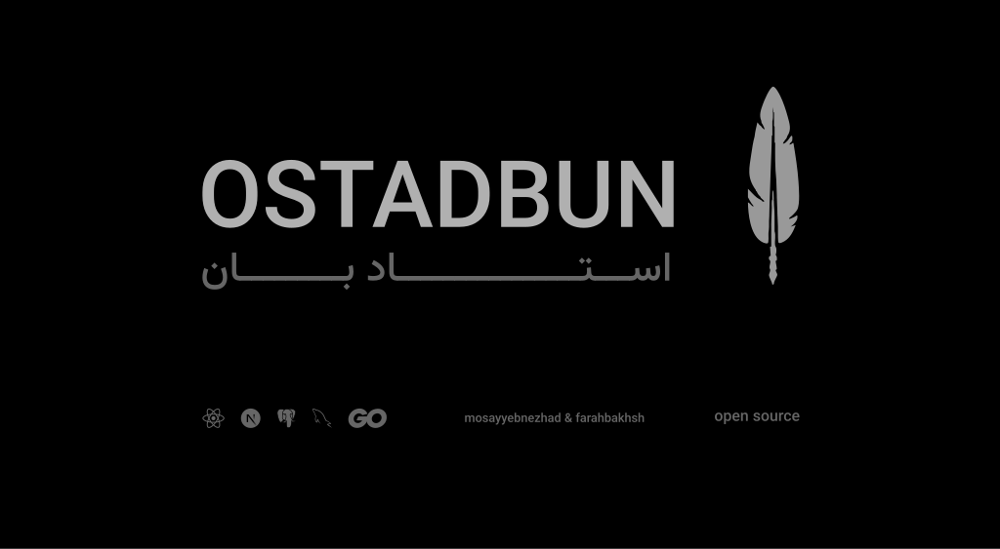

# OSTADBUN
OSTADBUN is an open-source, transparent, and community-driven platform designed to help students make smarter decisions when selecting professors and planning their academic paths. It aims to empower university students by providing reliable, crowdsourced insights about professors, courses, and academic experiences — all contributed and verified by the student community itself.

By focusing on openness and collaboration, OSTADBUN offers a space where students can share honest reviews, rate their academic experiences, and access detailed profiles of professors, including teaching style, grading policies, responsiveness, and more. The platform values transparency and collective wisdom, making it easier for students to navigate academic challenges and optimize their learning journey.

Whether you’re planning your next semester or trying to find the best professor for a specific subject, OSTADBUN helps you make informed, data-driven choices — all while supporting a growing community that believes in knowledge sharing, fairness, and academic improvement.

## applications

- [server core app](https://github.com/ostadbun/server)
- [react core client](https://github.com/ostadbun/Web-core)

## Developers

- [mohammad kazem farahbakhsh](https://github.com/Mohammadfarahbakhsh)
- [mohammad hasan mosayyebnezhad](https://github.com/mosayyebnezhad)

